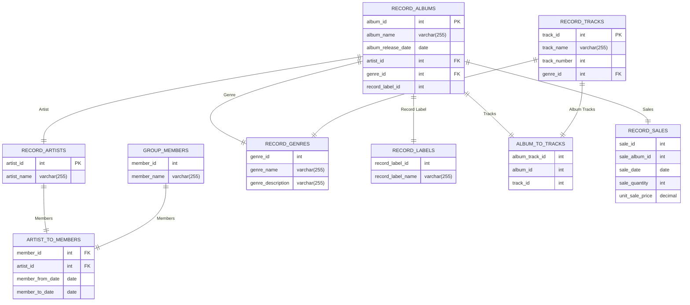

# CS-GY 6083 Spring 2024 Project

## Project Description
The project is to build an application that interfaces with a database to store and retrieve data. The application will be a simple command line interface that will allow the user to Create, Read, Update and Delete (CRUD) data. The data will be stored in a database and the application will use SQL to interact with the database.

## Project Requirements
The project will construct a database with 7 tables. The tables will be related to each other in a way that makes sense for the data. The application will allow the user to interact with the database by adding, retrieving, updating and deleting data. The application will also allow the user to query the database for specific data.

## Project Details
For my project I will construct a database to store information about record albums. The record album database will have a main table which lists the following features of a record album:

## Native Language
Python will be used to build the application and the database will be a MySQL database. The application will use the mysql library to interact with the database.

For security purposes, the password for the DB will be stored as an environment variable.

## Project Structure
The project will be structured as follows:
- ER Diagram from Record Album Database
- DLL
- Python Scripts for utilities
- Python Classes for Business Object definitions
- UI Classes to interact with the user

## Database Schema


### Entity Relationship Diagram


## DDL for album_information database
```sql
/******************************************************************************
  This script creates a pre-populated database for the album information
*******************************************************************************/

DROP DATABASE IF EXISTS album_information;

CREATE DATABASE album_information;

USE album_information;

CREATE TABLE RECORD_ARTISTS (
    artist_id int NOT NULL AUTO_INCREMENT,
    artist_name varchar(255),
    PRIMARY KEY (artist_id)
);

CREATE TABLE GROUP_MEMBERS (
    member_id int NOT NULL AUTO_INCREMENT,
    member_name varchar(255),
    PRIMARY KEY (member_id)
);

CREATE TABLE MEMBERS_TO_ARTISTS (
    members_to_artists_id int NOT NULL AUTO_INCREMENT,
    member_id int,
    artist_id int,
    member_from_date date,
    member_to_date date,
    PRIMARY KEY (members_to_artists_id),
    FOREIGN KEY (member_id) REFERENCES GROUP_MEMBERS(member_id),
    FOREIGN KEY (artist_id) REFERENCES RECORD_ARTISTS(artist_id)
);

CREATE TABLE RECORD_TRACKS (
    track_id int NOT NULL AUTO_INCREMENT,
    track_name varchar(255),
    track_number int,
    genre_id int,
    PRIMARY KEY (track_id)
);

CREATE TABLE RECORD_GENRES (
    genre_id int NOT NULL AUTO_INCREMENT,
    genre_name varchar(255),
    genre_description varchar(255),
    PRIMARY KEY (genre_id)
);

CREATE TABLE RECORD_LABELS (
    record_label_id int NOT NULL AUTO_INCREMENT,
    record_label_name varchar(255),
    PRIMARY KEY (record_label_id)
);

CREATE TABLE RECORD_ALBUMS (
    album_id int NOT NULL AUTO_INCREMENT,
    album_name varchar(255),
    album_release_date date,
    artist_id int,
    genre_id int,
    record_label_id int,
    PRIMARY KEY (album_id),
    FOREIGN KEY (artist_id) REFERENCES RECORD_ARTISTS(artist_id),
    FOREIGN KEY (genre_id) REFERENCES RECORD_GENRES(genre_id),
    FOREIGN KEY (record_label_id) REFERENCES RECORD_LABELS(record_label_id)
);

CREATE TABLE ALBUM_TO_TRACKS (
    album_track_id int NOT NULL AUTO_INCREMENT,
    album_id int,
    track_id int,
    PRIMARY KEY (album_track_id),
    FOREIGN KEY (album_id) REFERENCES RECORD_ALBUMS(album_id),
    FOREIGN KEY (track_id) REFERENCES RECORD_TRACKS(track_id)
);

CREATE TABLE RECORD_SALES (
    sale_id int NOT NULL AUTO_INCREMENT,
    album_id int,
    sale_date date,
    sale_quantity int,
    unit_sale_price decimal,
    PRIMARY KEY (sale_id),
    FOREIGN KEY (album_id) REFERENCES RECORD_ALBUMS(album_id)
);

CREATE VIEW album_information AS
    SELECT
        RECORD_ALBUMS.album_name,
        RECORD_ARTISTS.artist_name,
        RECORD_GENRES.genre_name,
        RECORD_LABELS.record_label_name,
        RECORD_ALBUMS.album_release_date
    FROM
        RECORD_ALBUMS
    JOIN RECORD_ARTISTS ON RECORD_ALBUMS.artist_id = RECORD_ARTISTS.artist_id
    JOIN RECORD_LABELS ON RECORD_ALBUMS.record_label_id = RECORD_LABELS.record_label_id
    JOIN RECORD_GENRES ON RECORD_ALBUMS.genre_id = RECORD_GENRES.genre_id;

CREATE VIEW album_information_details AS
    SELECT
        RECORD_ALBUMS.album_name,

        RECORD_ARTISTS.artist_name,
        record_genres.genre_name,
        RECORD_LABELS.record_label_name,
        RECORD_TRACKS.track_number,
        RECORD_TRACKS.track_name,
        RECORD_ALBUMS.album_release_date
    FROM
        RECORD_ALBUMS
    JOIN RECORD_ARTISTS ON RECORD_ALBUMS.artist_id = RECORD_ARTISTS.artist_id
    JOIN RECORD_LABELS ON RECORD_ALBUMS.record_label_id = RECORD_LABELS.record_label_id
    JOIN ALBUM_TO_TRACKS ON RECORD_ALBUMS.album_id = ALBUM_TO_TRACKS.album_id
    JOIN RECORD_TRACKS ON ALBUM_TO_TRACKS.track_id = RECORD_TRACKS.track_id
    JOIN RECORD_GENRES ON RECORD_TRACKS.genre_id = RECORD_TRACKS.genre_id
ORDER BY
    RECORD_ALBUMS.album_name, RECORD_TRACKS.track_number;

CREATE VIEW band_members AS
    SELECT
        RECORD_ARTISTS.artist_name,
        GROUP_MEMBERS.member_name
    FROM
        RECORD_ARTISTS
    JOIN MEMBERS_TO_ARTISTS ON RECORD_ARTISTS.artist_id = MEMBERS_TO_ARTISTS.artist_id
    JOIN GROUP_MEMBERS ON MEMBERS_TO_ARTISTS.member_id = GROUP_MEMBERS.member_id;


INSERT INTO record_artists (artist_name) VALUES
    ('Pink Floyd');

INSERT INTO group_members (member_name) VALUES
    ('Syd Barrett'),
    ('Roger Waters'),
    ('Richard Wright'),
    ('Nick Mason'),
    ('David Gilmour');

INSERT INTO members_to_artists (artist_id, member_id, member_from_date, member_to_date) VALUES
    ((SELECT artist_id FROM record_artists WHERE artist_name = 'Pink Floyd'), (SELECT member_id FROM group_members WHERE member_name = 'Syd Barrett'), '1965-01-01', '1968-01-01'),
    ((SELECT artist_id FROM record_artists WHERE artist_name = 'Pink Floyd'), (SELECT member_id FROM group_members WHERE member_name = 'Roger Waters'), '1965-01-01', '1985-01-01'),
    ((SELECT artist_id FROM record_artists WHERE artist_name = 'Pink Floyd'), (SELECT member_id FROM group_members WHERE member_name = 'Richard Wright'), '1965-01-01', '1980-01-01'),
    ((SELECT artist_id FROM record_artists WHERE artist_name = 'Pink Floyd'), (SELECT member_id FROM group_members WHERE member_name = 'Nick Mason'), '1965-01-01', '1995-01-01'),
    ((SELECT artist_id FROM record_artists WHERE artist_name = 'Pink Floyd'), (SELECT member_id FROM group_members WHERE member_name = 'David Gilmour'), '1968-01-01', '1995-01-01');

INSERT INTO record_genres (genre_name, genre_description) VALUES
    ('Rock', 'Rock music');

INSERT INTO record_labels (record_label_name) VALUES
    ('Harvest Capitol Records');

INSERT INTO record_albums (album_name, album_release_date, artist_id, genre_id, record_label_id) VALUES
    ('The Dark Side of the Moon', '1973-03-01',
     (SELECT artist_id FROM record_artists WHERE artist_name = 'Pink Floyd'),
     (SELECT genre_id FROM record_genres WHERE genre_name = 'Rock'),
     (SELECT record_label_id FROM record_labels WHERE record_label_name = 'Harvest Capitol Records'));

INSERT INTO record_sales(album_id, sale_date, sale_quantity, unit_sale_price) VALUES
    ((SELECT album_id FROM record_albums WHERE album_name = 'The Dark Side of the Moon'), '1973-01-01', 1000000, 10.00),
    ((SELECT album_id FROM record_albums WHERE album_name = 'The Dark Side of the Moon'), '1974-01-01', 1000000, 10.00),
    ((SELECT album_id FROM record_albums WHERE album_name = 'The Dark Side of the Moon'), '1975-01-01', 1000000, 10.00),
    ((SELECT album_id FROM record_albums WHERE album_name = 'The Dark Side of the Moon'), '1976-01-01', 1000000, 10.00),
    ((SELECT album_id FROM record_albums WHERE album_name = 'The Dark Side of the Moon'), '1977-01-01', 1000000, 10.00),
    ((SELECT album_id FROM record_albums WHERE album_name = 'The Dark Side of the Moon'), '1978-01-01', 1000000, 10.00),
    ((SELECT album_id FROM record_albums WHERE album_name = 'The Dark Side of the Moon'), '1979-01-01', 1000000, 10.00),
    ((SELECT album_id FROM record_albums WHERE album_name = 'The Dark Side of the Moon'), '1980-01-01', 1000000, 10.00),
    ((SELECT album_id FROM record_albums WHERE album_name = 'The Dark Side of the Moon'), '1981-01-01', 1000000, 10.00),
    ((SELECT album_id FROM record_albums WHERE album_name = 'The Dark Side of the Moon'), '1982-01-01', 1000000, 10.00),
    ((SELECT album_id FROM record_albums WHERE album_name = 'The Dark Side of the Moon'), '1983-01-01', 1000000, 10.00),
    ((SELECT album_id FROM record_albums WHERE album_name = 'The Dark Side of the Moon'), '1984-01-01', 1000000, 10.00),
    ((SELECT album_id FROM record_albums WHERE album_name = 'The Dark Side of the Moon'), '1985-01-01', 1000000, 10.00),
    ((SELECT album_id FROM record_albums WHERE album_name = 'The Dark Side of the Moon'), '1986-01-01', 1000000, 10.00),
    ((SELECT album_id FROM record_albums WHERE album_name = 'The Dark Side of the Moon'), '1987-01-01', 1000000, 10.00);

INSERT INTO record_tracks (track_name, track_number, genre_id) VALUES
    ('Speak to Me', 1, (SELECT genre_id FROM record_genres WHERE genre_name = 'Rock')),
    ('Breathe (In the Air)', 2, (SELECT genre_id FROM record_genres WHERE genre_name = 'Rock')),
    ('On the Run', 3, (SELECT genre_id FROM record_genres WHERE genre_name = 'Rock')),
    ('Time', 4, (SELECT genre_id FROM record_genres WHERE genre_name = 'Rock')),
    ('The Great Gig in the Sky', 5, (SELECT genre_id FROM record_genres WHERE genre_name = 'Rock')),
    ('Money', 6, (SELECT genre_id FROM record_genres WHERE genre_name = 'Rock')),
    ('Us and Them', 7, (SELECT genre_id FROM record_genres WHERE genre_name = 'Rock')),
    ('Any Colour You Like', 8, (SELECT genre_id FROM record_genres WHERE genre_name = 'Rock')),
    ('Brain Damage', 9, (SELECT genre_id FROM record_genres WHERE genre_name = 'Rock')),
    ('Eclipse', 10, (SELECT genre_id FROM record_genres WHERE genre_name = 'Rock'));

INSERT INTO album_to_tracks (album_id, track_id) VALUES
    ((SELECT album_id FROM record_albums WHERE album_name = 'The Dark Side of the Moon'), (SELECT track_id FROM record_tracks WHERE track_name = 'Speak to Me')),
    ((SELECT album_id FROM record_albums WHERE album_name = 'The Dark Side of the Moon'), (SELECT track_id FROM record_tracks WHERE track_name = 'Breathe (In the Air)')),
    ((SELECT album_id FROM record_albums WHERE album_name = 'The Dark Side of the Moon'), (SELECT track_id FROM record_tracks WHERE track_name = 'On the Run')),
    ((SELECT album_id FROM record_albums WHERE album_name = 'The Dark Side of the Moon'), (SELECT track_id FROM record_tracks WHERE track_name = 'Time')),
    ((SELECT album_id FROM record_albums WHERE album_name = 'The Dark Side of the Moon'), (SELECT track_id FROM record_tracks WHERE track_name = 'The Great Gig in the Sky')),
    ((SELECT album_id FROM record_albums WHERE album_name = 'The Dark Side of the Moon'), (SELECT track_id FROM record_tracks WHERE track_name = 'Money')),
    ((SELECT album_id FROM record_albums WHERE album_name = 'The Dark Side of the Moon'), (SELECT track_id FROM record_tracks WHERE track_name = 'Us and Them')),
    ((SELECT album_id FROM record_albums WHERE album_name = 'The Dark Side of the Moon'), (SELECT track_id FROM record_tracks WHERE track_name = 'Any Colour You Like')),
    ((SELECT album_id FROM record_albums WHERE album_name = 'The Dark Side of the Moon'), (SELECT track_id FROM record_tracks WHERE track_name = 'Brain Damage')),
    ((SELECT album_id FROM record_albums WHERE album_name = 'The Dark Side of the Moon'), (SELECT track_id FROM record_tracks WHERE track_name = 'Eclipse'));

INSERT INTO record_artists (artist_name) VALUES
    ('Boston');

INSERT INTO group_members (member_name) VALUES
    ('Tom Scholz'),
    ('Brad Delp'),
    ('Barry Goudreau'),
    ('Fran Sheehan'),
    ('Sib Hashian');

INSERT INTO members_to_artists (artist_id, member_id, member_from_date, member_to_date) VALUES
    ((SELECT artist_id FROM record_artists WHERE artist_name = 'Boston'), (SELECT member_id FROM group_members WHERE member_name = 'Tom Scholz'), '1975-01-01', '1989-01-01'),
    ((SELECT artist_id FROM record_artists WHERE artist_name = 'Boston'), (SELECT member_id FROM group_members WHERE member_name = 'Brad Delp'), '1975-01-01', '2007-01-01'),
    ((SELECT artist_id FROM record_artists WHERE artist_name = 'Boston'), (SELECT member_id FROM group_members WHERE member_name = 'Barry Goudreau'), '1975-01-01', '1981-01-01'),
    ((SELECT artist_id FROM record_artists WHERE artist_name = 'Boston'), (SELECT member_id FROM group_members WHERE member_name = 'Fran Sheehan'), '1975-01-01', '1986-01-01'),
    ((SELECT artist_id FROM record_artists WHERE artist_name = 'Boston'), (SELECT member_id FROM group_members WHERE member_name = 'Sib Hashian'), '1975-01-01', '1986-01-01');

INSERT INTO record_labels (record_label_name) VALUES
    ('Epic Records');

INSERT INTO record_albums (album_name, album_release_date, artist_id, genre_id, record_label_id) VALUES
    ('Boston', '1976-08-25',
     (SELECT artist_id FROM record_artists WHERE artist_name = 'Boston'),
     (SELECT genre_id FROM record_genres WHERE genre_name = 'Rock'),
     (SELECT record_label_id FROM record_labels WHERE record_label_name = 'Epic Records'));

INSERT INTO record_sales(album_id, sale_date, sale_quantity, unit_sale_price) VALUES
    ((SELECT album_id FROM record_albums WHERE album_name = 'Boston'), '1976-01-01', 1000000, 10.00),
    ((SELECT album_id FROM record_albums WHERE album_name = 'Boston'), '1977-01-01', 1000000, 10.00),
    ((SELECT album_id FROM record_albums WHERE album_name = 'Boston'), '1978-01-01', 1000000, 10.00),
    ((SELECT album_id FROM record_albums WHERE album_name = 'Boston'), '1979-01-01', 1000000, 10.00),
    ((SELECT album_id FROM record_albums WHERE album_name = 'Boston'), '1980-01-01', 1000000, 10.00),
    ((SELECT album_id FROM record_albums WHERE album_name = 'Boston'), '1981-01-01', 1000000, 10.00),
    ((SELECT album_id FROM record_albums WHERE album_name = 'Boston'), '1982-01-01', 1000000, 10.00),
    ((SELECT album_id FROM record_albums WHERE album_name = 'Boston'), '1983-01-01', 1000000, 10.00),
    ((SELECT album_id FROM record_albums WHERE album_name = 'Boston'), '1984-01-01', 1000000, 10.00),
    ((SELECT album_id FROM record_albums WHERE album_name = 'Boston'), '1985-01-01', 1000000, 10.00),
    ((SELECT album_id FROM record_albums WHERE album_name = 'Boston'), '1986-01-01', 1000000, 10.00),
    ((SELECT album_id FROM record_albums WHERE album_name = 'Boston'), '1987-01-01', 1000000, 10.00);

INSERT INTO record_tracks (track_name, track_number, genre_id) VALUES
    ('More Than a Feeling', 1, (SELECT genre_id FROM record_genres WHERE genre_name = 'Rock')),
    ('Peace of Mind', 2, (SELECT genre_id FROM record_genres WHERE genre_name = 'Rock')),
    ('Foreplay/Long Time', 3, (SELECT genre_id FROM record_genres WHERE genre_name = 'Rock')),
    ('Rock & Roll Band', 4, (SELECT genre_id FROM record_genres WHERE genre_name = 'Rock')),
    ('Smokin', 5, (SELECT genre_id FROM record_genres WHERE genre_name = 'Rock')),
    ('Hitch a Ride', 6, (SELECT genre_id FROM record_genres WHERE genre_name = 'Rock')),
    ('Something About You', 7, (SELECT genre_id FROM record_genres WHERE genre_name = 'Rock')),
    ('Let Me Take You Home Tonight', 8, (SELECT genre_id FROM record_genres WHERE genre_name = 'Rock'));

INSERT INTO album_to_tracks (album_id, track_id) VALUES
    ((SELECT album_id FROM record_albums WHERE album_name = 'Boston'), (SELECT track_id FROM record_tracks WHERE track_name = 'More Than a Feeling')),
    ((SELECT album_id FROM record_albums WHERE album_name = 'Boston'), (SELECT track_id FROM record_tracks WHERE track_name = 'Peace of Mind')),
    ((SELECT album_id FROM record_albums WHERE album_name = 'Boston'), (SELECT track_id FROM record_tracks WHERE track_name = 'Foreplay/Long Time')),
    ((SELECT album_id FROM record_albums WHERE album_name = 'Boston'), (SELECT track_id FROM record_tracks WHERE track_name = 'Rock & Roll Band')),
    ((SELECT album_id FROM record_albums WHERE album_name = 'Boston'), (SELECT track_id FROM record_tracks WHERE track_name = 'Smokin')),
    ((SELECT album_id FROM record_albums WHERE album_name = 'Boston'), (SELECT track_id FROM record_tracks WHERE track_name = 'Hitch a Ride')),
    ((SELECT album_id FROM record_albums WHERE album_name = 'Boston'), (SELECT track_id FROM record_tracks WHERE track_name = 'Something About You')),
    ((SELECT album_id FROM record_albums WHERE album_name = 'Boston'), (SELECT track_id FROM record_tracks WHERE track_name = 'Let Me Take You Home Tonight'));

```