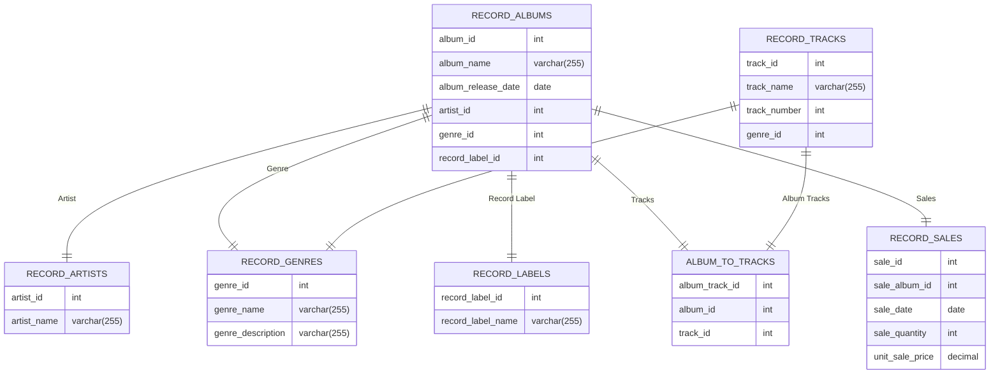

# CS-GY 6083 Spring 2024 Project

## Project Description
The project is to build an application that interfaces with a database to store and retrieve data. The application will be a simple command line interface that will allow the user to Create, Read, Update and Delete (CRUD) data. The data will be stored in a database and the application will use SQL to interact with the database.

## Project Requirements
The project will construct a database with 7 tables. The tables will be related to each other in a way that makes sense for the data. The application will allow the user to interact with the database by adding, retrieving, updating and deleting data. The application will also allow the user to query the database for specific data.

## Project Details
For my project I will construct a database to store information about record albums. The record album database will have a main table which lists the following features of a record album:
### Record Album Table:
- Album ID
- Name of the album
- Date the album was released
- Artist that performed on the album
- Genre for the album
- Record label the album was released under

### Record Album Tracks Table
Each album will have songs or tracks associated with it. The tracks will contain the following information:
- Name of the track
- Song number for the track
- Genre of the track

### Record Album Sales Table:
To track sales for each album we will use a record album sales table:
- Sales ID
- Record Album ID
- Sales Date
- Sales Quantity
- Unit Sales Price

## Supporting Tables

### Album to Tracks Table
To associate each record album with the songs on that album, a relationship table will be used:
- Album ID
- Track ID

### Artists Table
Supporting tables for the database will be:
Artist Table:
- Artist ID
- Artist Name

### Genres Table
Genre Table:
- Genre ID
- Genre Name
- Genre Description

### Record Label Table
- Record Label ID
- Record Label Name

## Native Language
Python will be used to build the application and the database will be a MySQL database. The application will use the mysql library to interact with the database.

For security purposes, the password for the DB will be stored as an environment variable.

## Project Structure
The project will be structured as follows:
- DLL
- Python Scripts for utilities
- Python Classes for Business Object definitions

## Database Schema


### Entity Relationship Diagram


## DDL for album_information database
```sql
CREATE DATABASE album_information;

USE album_information;

CREATE TABLE RECORD_ALBUMS (
    album_id int NOT NULL AUTO_INCREMENT,
    album_name varchar(255),
    album_release_date date,
    artist_id int,
    genre_id int,
    record_label_id int,
    PRIMARY KEY (album_id),
    FOREIGN KEY (artist_id) REFERENCES RECORD_ARTISTS(artist_id),
    FOREIGN KEY (genre_id) REFERENCES RECORD_GENRES(genre_id),
    FOREIGN KEY (record_label_id) REFERENCES RECORD_LABELS(record_label_id)
);

CREATE TABLE RECORD_ARTISTS (
    artist_id int NOT NULL AUTO_INCREMENT,
    artist_name varchar(255),
    PRIMARY KEY (artist_id)
);

CREATE TABLE RECORD_TRACKS (
    track_id int NOT NULL AUTO_INCREMENT,
    track_name varchar(255),
    track_number int,
    genre_id int,
    PRIMARY KEY (track_id)
);

CREATE TABLE RECORD_GENRES (
    genre_id int NOT NULL AUTO_INCREMENT,
    genre_name varchar(255),
    genre_description varchar(255),
    PRIMARY KEY (genre_id)
);

CREATE TABLE RECORD_LABELS (
    record_label_id int NOT NULL AUTO_INCREMENT,
    record_label_name varchar(255),
    PRIMARY KEY (record_label_id)
);

CREATE TABLE ALBUM_TO_TRACKS (
    album_track_id int NOT NULL AUTO_INCREMENT,
    album_id int,
    track_id int,
    PRIMARY KEY (album_track_id),
    FOREIGN KEY (album_id) REFERENCES RECORD_ALBUMS(album_id),
    FOREIGN KEY (track_id) REFERENCES RECORD_TRACKS(track_id)
);

CREATE TABLE RECORD_SALES (
    sale_id int NOT NULL AUTO_INCREMENT,
    album_id int,
    sale_date date,
    sale_quantity int,
    unit_sale_price decimal,
    PRIMARY KEY (sale_id),
    FOREIGN KEY (sale_id) REFERENCES RECORD_ALBUMS(album_id)
);
```