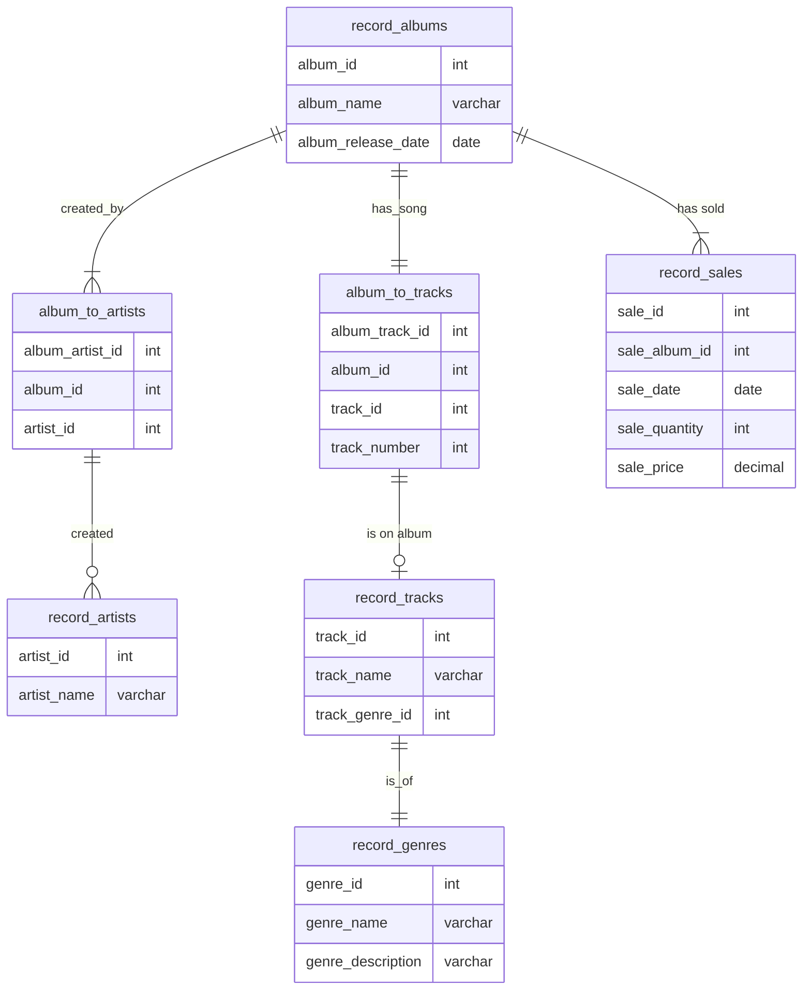

# CS-GY 6083 Spring 2024 Project

## Project Description
The project is to build an application that interfaces with a database to store and retrieve data. The application will be a simple command line interface that will allow the user to Create, Read, Update and Delete (CRUD) data. The data will be stored in a database and the application will use SQL to interact with the database.

## Project Requirements
The project will construct a database with 7 tables. The tables will be related to each other in a way that makes sense for the data. The application will allow the user to interact with the database by adding, retrieving, updating and deleting data. The application will also allow the user to query the database for specific data.

Python will be used to build the application and the database will be a MySQL database. The application will use the mysql library to interact with the database.

For security purposes, the password for the DB will be stored as an environment variable.

## Project Structure
The project will be structured as follows:
- A main file that will contain the main logic of the application
  - A file that will contain the database schema
  - A file that will contain the database connection logic
  - A file that will contain the logic to interact with the database
  - A file that will contain the logic to interact with the user
  - A file that will contain the logic to handle the environment variables

## Database Schema
### Schema Name: album_information

The database will contain 7 tables. The tables will be related to each other in a way that makes sense for the data. The tables will be as follows:
- Table 1: record_albums
- Table 2: record_artists
- Table 3: record_tracks
- Table 4: record_genres
- Table 5: album_to_artists
- Table 6: album_to_tracks
- Table 7: record_sales

### record_albums schema
- album_id: int
- album_name: varchar
- album_release_date: date

### record_artists schema
- artist_id: int
- artist_name: varchar

### record_tracks schema
- track_id: int
- track_name: varchar
- track_genre_id: int

### record_genres schema
- genre_id: int
- genre_name: varchar
- genre_description: varchar

### album_to_artists schema
- album_artist_id: int
- album_id: int
- artist_id: int

### album_to_tracks schema
- album_track_id: int
- album_id: int
- track_id: int
- track_number: int

### record_sales schema
- sale_id: int
- sale_album_id: int
- sale_date: date
- sale_quantity: int
- sale_price: decimal

### Entity Relationship Diagram
