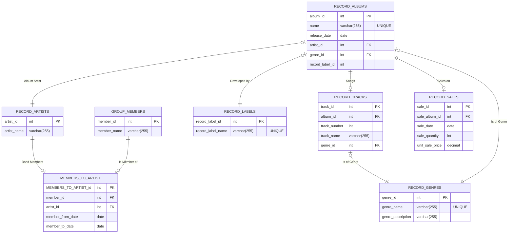

# CS-GY 6083 Spring 2024 Project
* **Author**: [Nicola Maiorana]
* **Date**: [2024-03-17]
* **Email**: [nam10102@nyu.edu]
* **Class**: [CS-GY 6083]

## Project Description
The project is to build an application that interfaces with a database to store and retrieve data. The application will be a simple command line interface that will allow the user to Create, Read, Update and Delete (CRUD) data. The data will be stored in a database and the application will use SQL to interact with the database.

## Project Requirements
The project will construct a database with a minimum of 7 tables. The tables will be related to each other in a way that makes sense for the data. The application will allow the user to interact with the database by adding, retrieving, updating and deleting data. The application will also allow the user to query the database for specific data.

## Project Details
For this project I will construct a database using MySQL to store information about record album: the name of the album, the recording date, the artists behind the album (bands), the members of the recording group, the record label which produced the album, genre and sales information. This will utilize a 2-tier architecture using Python as the primary Language.

I will construct business object classes to represent the data in Python using data classes. To map these data classes to the MySQL db, I will use the MySQL Connect coupled with dataclasses to create my Business Objects. Lastly I will construct a series of UI classes to perform Create, Read, Update and Delete operations on one of the tables.

## Entity Relationship Diagram
